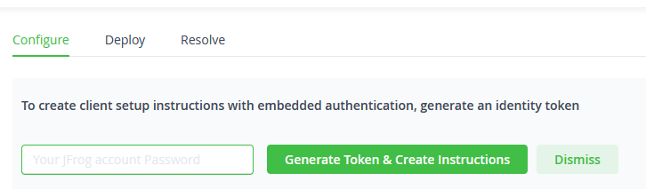
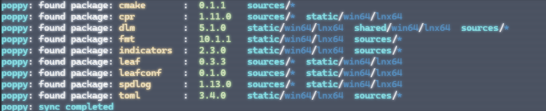

### Описание
**Poppy** - это пакетный менеджер для `C`/`C++`.
- *Язык:* 
- *Платформы:* 
- *Система сборки:* 

**Poppy** состоит из 3-х частей:
- `poppy-cli` - консольная утилита-фронтенд для работы с удаленным хранилищем артефактов и пакетов. Представляет из себя собранный без зависимостей на `glibc` нативный исполняемый файл.
- `poppup` - утилита для установки фронтенда в систему. На данный момент поддерживается только операционная система `Linux`, для установки на нативную `Windows` необходимо собрать и установить в PATH пакет вручную.

### Команды и сабкоманды
##### Общие:
- `--version` - вывести версию пакетного менеджера и информацию о сборке.
- `-h`, `--help` - вывести информацию о командах и сабкомандах.
- `-u`, `--username` - указать логин **Artifactory** .
- `-t`, `--token` - указать токен **Artifactory** .
- `-v`,  `--verbose` - выводить подробные логи выполнения команды.

##### Синхронизация 
Производится сабкомандой `sync`.

Опции:
- `-r`, `--registry` - эквивалентно команде `poppy install --list-registry`. Синхронизирует удаленный реестр в кэш и выводит список пакетов на экран.
- `-c`, `--cache-all` - производит **полное** скачивание удаленного репозитория в кэш в виде архивов *.tar.gz*. Необходимая команда для оффлайн-работы с пакетным менеджером.
- `--include-self` - расширение для предыдущей команды. Добавляет к скачиванию библиотек скачивание собственных дистрибутивов `poppy`.

##### Установка 
Производится сабкомандой `install`. 

Примеры:
```shell
poppy install -sf
poppy -v -u $USER -t $TOKEN install --sync --fresh 
```
Аргументы:
- `-l`, `--lazy` - не синхронизировать реестр, если он уже закеширован в системе.
- `-s`, `--sync` - синхронизировать реестр принудительно.
- `-f`, `--fresh` - удалить предыдущие установленные локально библиотеки и произвести чистую установку.
- `-a`, `--arch` - выбрать архитектуру. По умолчанию выбирается нативная архитектура системы. Может принимать следующие значения:
  - *windows-x64*
  - *linux-x64*
  - *any*
- `-e`, `--exact-version` - при установке будет выключена оптимизация версий одного и того же пакета в древе зависимостей. Например, если в дереве зависимостей есть следующие 2 пакета: `test@1.0.0/static/any` и `test@1.0.1/static/any`, то без этого флага будет установлен только более свежий пакет, с флагом `--exact-version` будут установленны оба пакета.
  > Совет разработчикам: если ваша библиотека/приложение не компилируется без этого флага, значит вы что-то делаете не так. Этот флаг подразумевается как отладочный и не предназачен для релизных пакетов.

  > Еще один совет: каждый раз, когда вы меняете API/архитектуру своей библиотеки в новой версии, удаляя или переименовывая функции, вы нарушаете основной принцип работы пакетного менеджера - **обратная совместимость релизных библиотек**. Если вы считаете, что какая-либо функция/класс устарела, то не нужно ее удалять - используйте флаги, такие как: `[[gnu::deprecated]]`, `__attribute__((deprecated))` и т.д. Удаление функционала библиотеки, равно как и его переименование, должно происходить по согласованию с пользователями вашей библиотеки.
- `--list-registry` - вывести список установленных пакетов в реестре. **Пропускает процесс установки.**
  > Предпочтительнее использовать команду `poppy sync -r`.

##### Экспорт
Экспорт файла/пакета в **Artifactory** производится сабкомандой `push`.

Примеры:
```shell
poppy push example.tar.gz -a any -d sources
poppy -v push example.tar.gz --arch linux-x64 --distribution static --force
```

Аргументы:
- `-a`, `--arch` - указывает архитектуру пакета. **Это обязательный параметр**. Может принимать следующие значения:
  - *windows-x64*
  - *linux-x64*
  - *any*
- `-d`, `--distribution` - указывает тип пакета. **Это обязательный параметр**. Может принимать следующие значения:
  - *sources*
  - *static*
  - *shared*
  - *executable*
- `-f`, `--force` - перезаписать существующий пакет в реестре, если таковой имеется.
  > Это опасный параметр. Просьба проявлять осторожность при его использовании и никогда не использовать его в CI/CD.

##### Очистка 
Очистка текущей рабочей директории от установленных пакетов производится сабкомандой `clean`.

Пример:
```shell
poppy clean
```

Очистка реестра производится сабкомандой `purge`.

Пример:
```shell
poppy purge --config
poppy purge --cache
poppy -v purge --all
```

Аргументы:
- `--cache` - очистить только кэш.
- `--config` - очистить только конфигурацию.
- `--all` - очистить конфигурацию и кэш.
> Примечание: очистка конфига приведет к удалению токена и имени пользователя в Artifactory.

##### Получение данных из манифеста
Для разработчиков CI/CD пайплайнов `poppy` предоставляет парсер манифест-файлов.

Пример:
```shell
poppy parse name
poppy parse version
poppy parse wd
```

Вывод:
```shell
test
1.1.1
/home/user/test
```

Может принимать следующие паттерны:
- `name` - выводит имя пакета
- `version` - выводит версию пакета
- `wd` - выводит текущую рабочую директорию
- `authors` - выводит авторов пакета
- `description` - выводит описание пакета

### Предварительная конфигурация
Для работы с `poppy` пользователю потребуется:
-   ~~Логин/пароль **GitLab**, в котором лежит реестр~~ (если вы читаете это на GitLab, у вас они уже есть)
-  Логин/токен **Artifactory**:
  - Логин можно получить у системного администратора.
  - С логином и паролем нужно зайти в UI-часть [(сюда)](http://uav.radar-mms.com/ui) и сгенерировать токен:
    - Нужно нажать на *Set me up*: 
    - 
    - Сгенерировать токен в появившемся окне:
    - 
    - Запомнить/сохранить токен в надежном месте.
- Установить `python3` и модуль `requests`:
  - Для пользователей **Arch Linux/Manjaro**:
    - `sudo pacman -Sy python python-requests --noconfirm`
  - Для пользователей **Microsoft Windows**:
    - `python3` - откроет страницу в MSS если Python не установлен
    - `pip install requests`

### Установка Poppy
- Скачиваем `poppup.py` отсюда: [ссылка](http://uav.radar-mms.com/gitlab/test/essentials/poppy/poppy-cli/-/raw/main/poppup.py?ref_type=heads)
- Запускаем `poppup.py`: 
  - `python3 poppup.py --install-latest --arch=linux-x64 --user=ЛОГИН_АРТИФАКТОРИ --token=ТОКЕН_АРТИФАКТОРИ`
- Установка прошла успешно, если последняя строка в выводе скрипта имеет вид:
  - `installed poppy to ....`
- Проверяем установку командой `poppy --version`
- *ОПЦИОНАЛЬНО*: Синхронизируем реестр командой `poppy sync --registry`.
- *ОПЦИОНАЛЬНО*: Скачиваем пакеты для оффлайн-работы ПМ командой `poppy sync --cache-all`.

### Использование
`Poppy` использует manifest-файлы для разрешения зависимостей. 

В существующем или новом проекте рядом с `CMakeLists.txt` нужно создать файл с одним из следующих имен (**можно выбрать какое нравится больше**):
- `poppy-manifest.toml`
- `poppy.toml`
- `pppm.toml`

В этом файле будет находится описание пакета: имя, версии и зависимости. В каждом пакете обязательно должен быть manifest-файл.

Пример манифеста:
```toml
[package]
name = "test"
authors = [
  "whs31 <whs31@github.io>"
]
description = "This is an example manifest"

[package.version]
major = 1
minor = 0
patch = 17

[dependencies]
spdlog = { version = { major = 12, minor = 4, patch = 4 }, distribution = "static" }
cmake = { version = { major = 0, minor = 1, patch = 0 }, distribution = "sources" }
fmt = { version = { major = 1, minor = 2, patch = 3 }, distribution = "shared" }
```
Этот манифест описывает пакет с именем `test` версии `1.0.17`, который зависит от библиотек:
- `spdlog@12.4.4/static`
- `cmake@0.1.0/sources`
- `fmt@1.2.3/shared`

#### Как узнать какие библиотеки доступны?
Для этого можно написать команду `poppy install --list-registry`, которая выдаст список библиотек в реестре `poppy`:


#### Poppy требует авторизацию в артифактори! Что делать?
Необходимо написать следующие команды:
- `poppy purge --all`
- `poppy install --sync --list-registry`
  - Ввести логин, затем токен

### Установка библиотек
В директории с манифестом запускаем:
- `poppy install --sync`
Если в манифесте нет ошибок, то библиотеки будут установленны в локальную папку `dependencies`.
Для сборки CMake-проекта с использованием `poppy` нужно указать префикс этой директории:
- `cmake -GNinja -DCMAKE_PREFIX_PATH=./dependencies ..`
- `cmake --build .`

### Помощь и поддержка
При возникших проблемах:
- `poppy --help`
- Если не помогло, открываем тикет здесь: [**YouTrack**](https://whs31.youtrack.cloud/projects/0-4?isNew=default)
